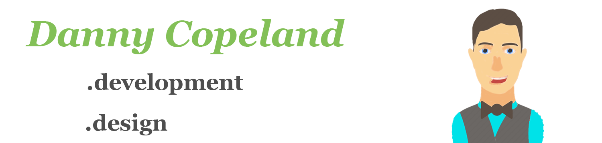

I'm a software developer with a focus on iOS development. I recently released my first self published app, [Wacky Casino](https://apps.apple.com/us/app/wacky-casino/id1556778552) to the Apple store, a fun and quirky mix of casual games with a casino atmosphere.

My day job I am lucky enough to work on every aspect of 2 full feature commercial ecommerce applications live in the Apple App Store.

In my spare time I am working on scoping and mocking out an NHL pick-um style application, revamping my website and playing with multiple other side projects and Apple frameworks. 

I have been very fortunate to have exposure to all aspects of the software development life cycle. I have worked on a multitude of Apple and 3rd party SDKs, but I know I have even more yet to learn. I remember the old provisioning profile nightmares and am no stranger to vague Apple review kickbacks, but even with the woes I wouldn't trade it for anything. I am excited for what the future brings. 

My most recent years of experience have all been in the Apple ecosystem, but my programing roots began in .Net land.

* **Skill (Total Exp)**
* Swift (3+ Years)
* Objective - C (1+ Year)
* C# .Net / .Net Core API's (3+ Years)
* Java (1+ Year)
* SQL (1+ year)
* JavaScript / HTML / CSS (1+ Year)

Always learning. Some of my favorite learning resources:
* [Stanford iOS Courses](https://www.youtube.com/playlist?list=PLpGHT1n4-mAsxuRxVPv7kj4-dQYoC3VVu)
* [Brian Voong](https://www.youtube.com/c/LetsBuildThatApp)
* [Sean Allen](https://www.youtube.com/c/SeanAllen) 
* [Paul Hudson](https://www.youtube.com/c/PaulHudson)
* [WWDC Videos](https://developer.apple.com/videos/)

## Find Me @:
Website: https://codecantina.com || Twitter: [@Code_Cantina](https://twitter.com/Code_Cantina)

